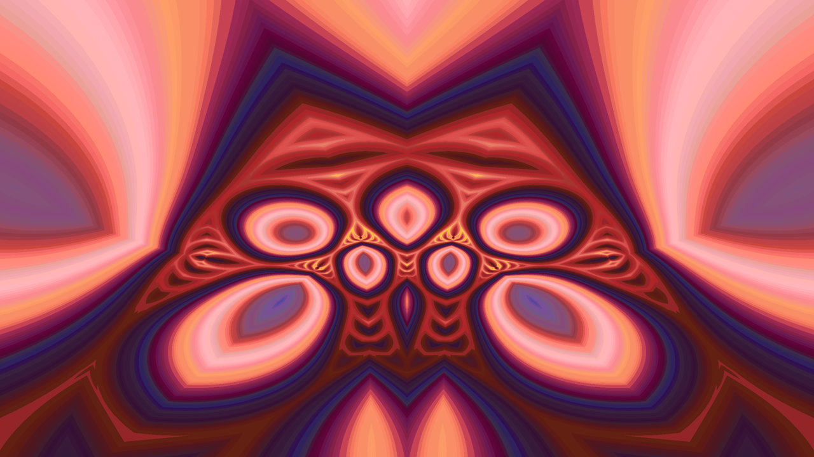
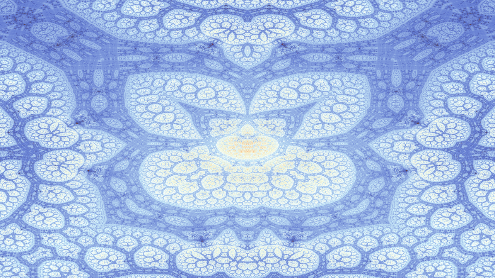

This repository contains standalone program to render digital art.

# [quack.py](quack.py)

The duck set fractal, from
[this article](http://www.algorithmic-worlds.net/blog/blog.php?Post=20110227)

# [numbers-on-a-flower.py](flower-seeds.py)

Flower seeds distribution representation based on
[this video](https://www.youtube.com/watch?v=sj8Sg8qnjOg)

# [multiplication-on-a-circle.py](multiplication-on-a-circle.py)

Multiplication table on a circle from
[this video](https://www.youtube.com/watch?v=-X49VQgi86E)

[recaman.py](animations/recaman.py) melody representation on a circle

# [markus-lyapunov.py](markus-lyapunov.py)

The lyapunov exponent of population growth using markus function to
change the rate based on a binary seed, from
[wikipedia](https://en.wikipedia.org/wiki/Lyapunov_fractal).

# [sandpile.py](sandpile.py)

Sandpile fractal, from [this video](https://www.youtube.com/watch?v=1MtEUErz7Gg)

# [animations](animations/)

Midi/Spectrogram based animation of iterated complex function fractal.

[rokano.py](animations/rokano.py)

[rosko.py](animations/rosko.py)

[memosp2.py](animations/memosp2.py)

[oldchords.py](animations/oldchords.py)

[anvil.py](animations/anvil.py)

[EoJ.py](animations/EoJ.py)

[inline.py](animations/inline.py)

[notre.py](animations/notre.py)

[dafP1.py](animations/dafP1.py)

[comptine.py](animations/comptine.py)

[weightless-morning.py](animations/weightless-morning.py)

[maintenance.py](animations/maintenance.py)

[siouze.py](animations/siouze.py)

[waldo.py](animations/waldo.py)

[buttons.py](animations/buttons.py)

[acidula-beat.py](animations/acidula-beat.py)

[fatou-v2.py](animations/fatou-v2.py)

[lmgg.py](animations/lmgg.py)

[lmgg2.py](animations/lmgg2.py)

[lmgg3.py](animations/lmgg3.py)

[gobansan.py](animations/gobansan.py)

[profondeur.py](animations/profondeur.py)

[ggb.py](animations/ggb.py)

[duna.py](animations/duna.py)

[fatou.py](animations/fatou.py)

[dirty-muffin.py](animations/dirty-muffin.py)

[tounex.py](animations/tounex.py)

[lm95p1.py](animations/lm95p1.py)

# [spectrogram.py](spectrogram.py)

FFT and frequency band visualisation.

