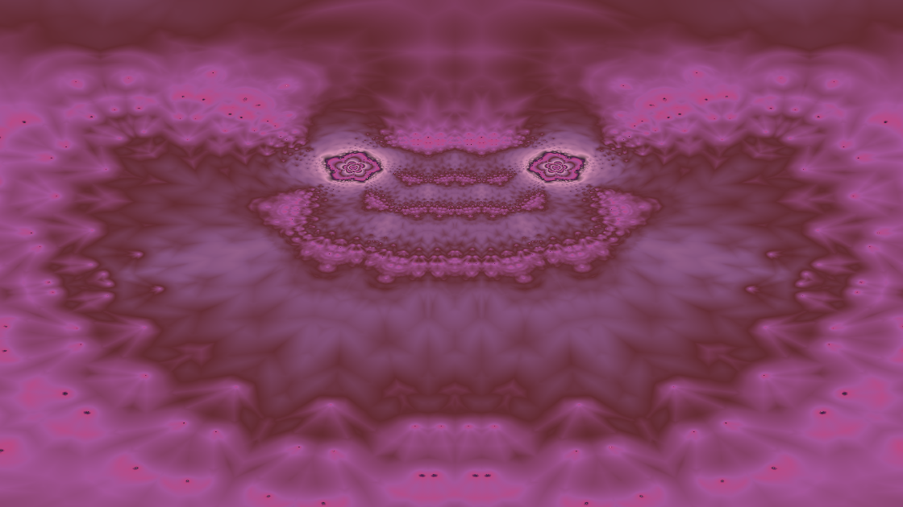

This repository contains standalone program to render digital art.

# [quack](quack.py)

The duck set fractal, from
[this article](http://www.algorithmic-worlds.net/blog/blog.php?Post=20110227)

# [multiplication-on-a-circle](multiplication-on-a-circle.py)

Multiplication table on a circle from
[this video](https://www.youtube.com/watch?v=-X49VQgi86E)

# [markus-lyapunov](markus-lyapunov.py)

The lyapunov exponent of population growth using markus function to
change the rate based on a binary seed, from
[wikipedia](https://en.wikipedia.org/wiki/Lyapunov_fractal).

# [sandpile](sandpile.py)

Sandpile fractal, from [this video](https://www.youtube.com/watch?v=1MtEUErz7Gg)

# [animations](animations/)

Midi/Spectrogram based animation of the JuliaSet.

[ggb](animations/ggb.py)

[duna](animations/duna.py)

[fatou](animations/fatou.py)

[dirty-muffin](animations/dirty-muffin.py)

[tounex](animations/tounex.py)

[lm95p1](animations/lm95p1.py)

# [spectrogram](spectrogram.py)

FFT and frequency band visualisation.

